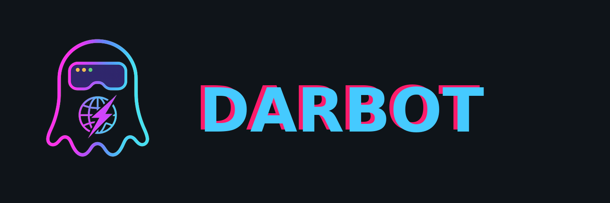

# Darbot Browser MCP



**Autonomous browser control for MCP clients, GitHub Copilot, Copilot Studio, and .NET services.**

[](https://github.com/darbotlabs/darbot-browser-mcp/actions)
[](https://www.npmjs.com/package/@darbotlabs/darbot-browser-mcp)
[](https://marketplace.visualstudio.com/items?itemName=darbotlabs.darbot-browser-mcp)
[](LICENSE)
[](https://github.com/darbotlabs/darbot-browser-mcp/stargazers)

## v2.1.4 highlights

- **Best-of reconcile matrix:** GitHub canonical runtime (Playwright 1.60 hardening, webdriver suppress, persistent-context fast-fail) plus ADO/fleet enterprise surfaces (auth, Azure bicep, PP connector, NuGet, extensions) on one version line.
- Registration-truth **68** native MCP tools (63 accessibility-first and management tools + 5 coordinate-based screen tools), including portable session-state and workspace-metadata imports.
- Bridge auto-detection for Chrome/Edge extension relays on ports `9223`-`9225`.
- Hosted + cloud VS Code extensions and Azure-first deployment path for enterprise MCP endpoints.
- OAuth with Microsoft Entra ID, explicit `SERVER_BASE_URL`, API key, tunnel, and managed identity auth.
- Health probes: `/health`, `/ready`, and `/live`.
- OpenAPI generation for Copilot Studio and Power Platform (full tool-aligned connector actions).
- Unified npm and extension package versions at **2.1.4**.
- Documentation under [`docs/`](docs/README.md).

## Quick install

```bash
# npm / npx
npx @darbotlabs/darbot-browser-mcp@2.1.4 --browser msedge

# VS Code Marketplace
code --install-extension darbotlabs.darbot-browser-mcp

# NuGet
dotnet add package DarbotLabs.Browser.MCP
```

## 60-second example

Add the MCP server to VS Code settings:

```json
{
  "chat.mcp.enabled": true,
  "chat.mcp.servers": {
    "darbot-browser": {
      "command": "npx",
      "args": ["@darbotlabs/darbot-browser-mcp@2.1.4", "--browser", "msedge"]
    }
  }
}
```

Then ask Copilot Agent Mode:

```text
Use darbot-browser to navigate to https://example.com, capture a snapshot, evaluate document.title, and save a screenshot.
```

Typical tool flow: `browser_navigate` → `browser_snapshot` → `browser_evaluate` → `browser_take_screenshot`.

## Feature matrix

Current registration-truth tool surface from `src/tools.ts`: **68** unique tools — **63** accessibility-first and management tools plus **5** coordinate-based `browser_screen_*` tools, all registered as core tools in every session.

| Category | Examples |
| --- | --- |
| Navigation and page state | `browser_navigate`, `browser_navigate_back`, `browser_snapshot`, `browser_evaluate` |
| Interaction | `browser_click`, `browser_type`, `browser_select_option`, `browser_drag`, `browser_press_key` |
| Media and artifacts | `browser_take_screenshot`, `browser_pdf_save`, `browser_file_upload` |
| Tabs and browser lifecycle | `browser_tab_new`, `browser_tab_select`, `browser_tab_close`, `browser_close` |
| Debugging | `browser_console_messages`, `browser_network_requests`, `browser_performance_metrics` |
| Session and profiles | `browser_save_profile`, `browser_export_session_state`, `browser_import_session_state`, `browser_import_workspace_metadata`, `browser_switch_profile`, `browser_discover_profiles` |
| Autonomous and AI-native | `browser_execute_intent`, `browser_execute_workflow`, `browser_start_autonomous_crawl` |
| Emulation, clock, storage | geolocation, timezone, media, clock, cookie, and localStorage tools |

See the complete [tool catalog](docs/reference/tools.md).

## Architecture

```mermaid
flowchart LR
  Client[MCP client] -->|stdio or HTTP| Server[Darbot Browser MCP]
  Server --> Tools[68 registered tools]
  Tools --> Browser[Playwright browser]
  Server -->|bridge auto-detect| Bridge[CDP relay :9223-9225]
  Bridge --> Extension[Chrome/Edge extension]
  Extension --> Tab[Existing user tab]
  Server --> API[/health /ready /live /mcp /openapi.json]
```

Read the [architecture overview](docs/architecture/overview.md) and [bridge protocol](docs/architecture/bridge-protocol.md).

## Installation

- [Installation guide](docs/getting-started/installation.md)
- [Quickstart](docs/getting-started/quickstart.md)
- [VS Code extension](docs/integrations/vscode-extension.md)
- [Azure deployment](docs/integrations/azure-deployment.md)
- [NuGet integration](docs/integrations/nuget.md)

## Tools

The server exposes navigation, interaction, capture, debugging, session-state, AI-native, autonomous crawl, emulation, clock, cookie, storage, and coordinate-based screen tools. Start with `browser_snapshot` before interacting with unfamiliar pages, and use `browser_evaluate` only for scoped DOM inspection or controlled page-context logic.

## Integrations

- [Copilot Studio](docs/integrations/copilot-studio.md)
- [Power Platform](docs/integrations/power-platform.md)
- [VS Code](docs/integrations/vscode-extension.md)
- [Azure](docs/integrations/azure-deployment.md)
- [NuGet](docs/integrations/nuget.md)

## Configuration

```bash
npx @darbotlabs/darbot-browser-mcp@2.1.4 \
  --browser msedge \
  --port 8931 \
  --allowed-origins "https://example.com" \
  --output-dir .darbot/output
```

For hosted auth:

```bash
SERVER_BASE_URL=https://darbot-mcp-prod.azurewebsites.net
ENTRA_AUTH_ENABLED=true
AZURE_TENANT_ID=<tenant-id>
AZURE_CLIENT_ID=<client-id>
AZURE_CLIENT_SECRET=<client-secret>
```

See [configuration](docs/getting-started/configuration.md), [CLI reference](docs/reference/cli.md), and [authentication](docs/architecture/auth.md).

## Development

```bash
npm install
npm run build
npm test
npm run lint
```

Read [CONTRIBUTING.md](CONTRIBUTING.md) before opening a pull request.

## Project documents

- [Documentation](docs/README.md)
- [Changelog](CHANGELOG.md)
- [Contributing](CONTRIBUTING.md)
- [Security](#security)
- [Release tracker archive](docs/history/release-tracker-archive.md)
- [Code of Conduct](CODE_OF_CONDUCT.md)

## Security

Do not expose `/mcp` or `/api/v1/tools/*` on a network without authentication
and TLS. Use Entra ID/OAuth for user-delegated access, API keys only for
constrained service-to-service calls, and `SERVER_BASE_URL` for every OAuth
deployment. See [SECURITY.md](SECURITY.md) for the supported reporting process.

## License

Licensed under the [Apache License 2.0](LICENSE).
