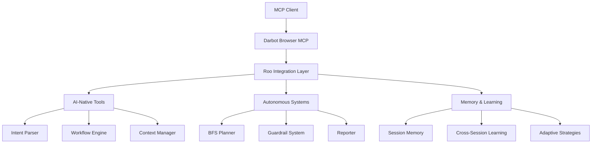

# 🤖 Complete Roo Integration Guide - Darbot Browser MCP

**Integration Guide Version**: 1.0  
**Created**: January 22, 2025  
**For**: Developers, AI Engineers, and System Integrators  
**Status**: Ready for Implementation

## 📋 Table of Contents

1. [Quick Start](#-quick-start)
2. [Architecture Overview](#-architecture-overview) 
3. [Installation & Setup](#-installation--setup)
4. [Roo Tools Reference](#-roo-tools-reference)
5. [Usage Examples](#-usage-examples)
6. [Advanced Integration](#-advanced-integration)
7. [Troubleshooting](#-troubleshooting)
8. [API Reference](#-api-reference)

## 🚀 Quick Start

### Prerequisites
- **Node.js 18+** with darbot-browser-mcp installed
- **MCP-compatible client** (VS Code, Claude Desktop, etc.)
- **Understanding of**: Browser automation, AI workflows, MCP protocol

### 5-Minute Setup
```bash
# 1. Install darbot-browser-mcp with roo integration
npm install -g @darbotlabs/darbot-browser-mcp@latest

# 2. Verify roo tools are available
darbot-browser-mcp --help | grep roo

# 3. Start with roo-enabled configuration
darbot-browser-mcp --enable-roo --roo-learning-mode
```

### First Roo Interaction
```javascript
// In your MCP client
await roo_execute_task({
  task_description: "Help me extract all product information from this e-commerce page",
  context: "I need structured data for price comparison analysis",
  adaptive_mode: true,
  progress_reporting: true
});
```

## 🏗️ Architecture Overview

### Roo Integration Points



### System Components

#### Core Roo Tools (6 Tools)
1. **`roo_execute_task`** - Multi-step task execution with AI guidance
2. **`roo_analyze_workflow`** - Website workflow analysis and optimization
3. **`roo_intelligent_wait`** - Smart waiting with contextual understanding
4. **`roo_content_extraction`** - Semantic content extraction and structuring
5. **`roo_session_memory`** - Enhanced memory with cross-session learning
6. **`roo_adaptive_interaction`** - Adaptive strategies based on website behavior

#### Enhanced AI Systems
- **Roo Intent Parser**: Natural language command understanding
- **Adaptive Workflow Engine**: Self-optimizing automation workflows
- **Intelligent Context Manager**: Multi-session awareness and learning
- **Enhanced Memory System**: Semantic understanding and pattern recognition

## 📦 Installation & Setup

### Method 1: NPM Installation (Recommended)

```bash
# Global installation with roo features
npm install -g @darbotlabs/darbot-browser-mcp@latest

# Verify roo integration
darbot-browser-mcp --version --features
```

### Method 2: VS Code Extension

```bash
# Install VS Code extension with auto roo configuration
code --install-extension darbotlabs.darbot-browser-mcp

# Extension automatically enables roo tools
# Check Command Palette: "Darbot Browser MCP: Enable Roo Features"
```

### Method 3: Docker Deployment

```bash
# Run with roo features enabled
docker run -i --rm \
  -e DARBOT_ENABLE_ROO=true \
  -e DARBOT_ROO_LEARNING_MODE=true \
  mcr.microsoft.com/playwright/mcp:roo-enabled
```

### Configuration Options

```json
{
  "roo": {
    "enabled": true,
    "learning_mode": true,
    "adaptive_strategies": true,
    "cross_session_memory": true,
    "semantic_analysis": true,
    "progress_reporting": "detailed",
    "error_recovery": "intelligent",
    "memory_retention_days": 30
  }
}
```

## 🛠️ Roo Tools Reference

### 1. `roo_execute_task` - AI-Guided Task Execution

**Purpose**: Execute complex multi-step browser tasks with intelligent guidance and adaptive strategies.

**Parameters**:
```typescript
{
  task_description: string;     // Natural language task description
  context?: string;            // Additional context and goals
  adaptive_mode?: boolean;     // Enable adaptive strategy selection
  progress_reporting?: boolean; // Real-time progress updates
  error_recovery?: boolean;    // Intelligent error recovery
  max_duration?: number;       // Maximum task duration (ms)
  priority?: 'low' | 'normal' | 'high'; // Task priority level
}
```

**Example Usage**:
```javascript
const result = await roo_execute_task({
  task_description: "Research and compare pricing for iPhone 15 across top 3 e-commerce sites",
  context: "Need current pricing data for market analysis report",
  adaptive_mode: true,
  progress_reporting: true,
  error_recovery: true,
  priority: 'high'
});
```

**Response Structure**:
```typescript
{
  success: boolean;
  task_id: string;
  execution_time: number;
  steps_completed: number;
  adaptations_applied: string[];
  results: {
    structured_data: any;
    screenshots: string[];
    workflow_insights: WorkflowInsight[];
  };
  learning_insights: LearningInsight[];
}
```

### 2. `roo_analyze_workflow` - Intelligent Workflow Analysis

**Purpose**: Analyze website workflows and provide optimization suggestions with AI insights.

**Parameters**:
```typescript
{
  analysis_depth: 'surface' | 'detailed' | 'comprehensive';
  focus_areas: Array<'ux' | 'performance' | 'accessibility' | 'automation'>;
  generate_suggestions: boolean;
  create_automation: boolean;
  benchmark_against?: string; // URL for comparison
}
```

**Example Usage**:
```javascript
const analysis = await roo_analyze_workflow({
  analysis_depth: 'comprehensive',
  focus_areas: ['ux', 'automation'],
  generate_suggestions: true,
  create_automation: true
});
```

### 3. `roo_intelligent_wait` - Smart Contextual Waiting

**Purpose**: Advanced waiting with AI-driven condition detection and adaptive timing.

**Parameters**:
```typescript
{
  wait_condition: string;      // Natural language condition
  max_wait_time: number;       // Maximum wait duration
  adaptive_polling: boolean;   // Adjust polling frequency
  context_awareness: boolean;  // Use page context for prediction
  fallback_strategy?: string;  // Fallback if condition not met
}
```

**Example Usage**:
```javascript
await roo_intelligent_wait({
  wait_condition: "All product images have loaded and search results are complete",
  max_wait_time: 30000,
  adaptive_polling: true,
  context_awareness: true
});
```

### 4. `roo_content_extraction` - Semantic Content Extraction

**Purpose**: Extract and structure web content with AI-driven semantic understanding.

**Parameters**:
```typescript
{
  extraction_target: string;    // Natural language description
  output_format: 'json' | 'csv' | 'markdown' | 'structured';
  semantic_analysis: boolean;   // Apply semantic understanding
  relationship_mapping: boolean; // Map element relationships
  quality_threshold?: number;   // Minimum confidence threshold
}
```

**Example Usage**:
```javascript
const extracted = await roo_content_extraction({
  extraction_target: "All product cards with name, price, rating, and availability",
  output_format: 'json',
  semantic_analysis: true,
  relationship_mapping: true,
  quality_threshold: 0.85
});
```

### 5. `roo_session_memory` - Enhanced Session Memory

**Purpose**: Advanced session memory with learning and cross-session pattern recognition.

**Parameters**:
```typescript
{
  memory_operation: 'store' | 'retrieve' | 'analyze' | 'optimize';
  memory_scope: 'current_session' | 'cross_session' | 'global_patterns';
  learning_mode: boolean;       // Enable pattern learning
  memory_retention: number;     // Retention period in days
  privacy_mode?: boolean;       // Anonymize sensitive data
}
```

**Example Usage**:
```javascript
// Store insights from current session
await roo_session_memory({
  memory_operation: 'store',
  memory_scope: 'cross_session',
  learning_mode: true,
  memory_retention: 30
});

// Retrieve relevant patterns for current task
const patterns = await roo_session_memory({
  memory_operation: 'retrieve',
  memory_scope: 'global_patterns',
  learning_mode: true
});
```

### 6. `roo_adaptive_interaction` - Adaptive Interaction Strategies

**Purpose**: Develop and apply adaptive interaction strategies that learn from website responses.

**Parameters**:
```typescript
{
  interaction_goal: string;     // High-level interaction goal
  adaptation_strategy: 'conservative' | 'balanced' | 'aggressive';
  learning_persistence: boolean; // Remember successful strategies
  fallback_options: number;     // Number of fallback strategies
  performance_optimization: boolean; // Optimize for speed/reliability
}
```

**Example Usage**:
```javascript
const strategy = await roo_adaptive_interaction({
  interaction_goal: "Navigate through multi-step checkout process efficiently",
  adaptation_strategy: 'balanced',
  learning_persistence: true,
  fallback_options: 3,
  performance_optimization: true
});
```

## 💡 Usage Examples

### Example 1: E-commerce Price Research

```javascript
// Comprehensive price research workflow
const priceResearch = async () => {
  // Step 1: Execute main research task
  const taskResult = await roo_execute_task({
    task_description: "Compare iPhone 15 prices across Amazon, Best Buy, and Apple Store",
    context: "Need current pricing for quarterly price trend analysis",
    adaptive_mode: true,
    progress_reporting: true
  });
  
  // Step 2: Extract structured pricing data
  const pricingData = await roo_content_extraction({
    extraction_target: "Product prices, availability, shipping costs, and customer ratings",
    output_format: 'json',
    semantic_analysis: true,
    relationship_mapping: true
  });
  
  // Step 3: Store insights for future use
  await roo_session_memory({
    memory_operation: 'store',
    memory_scope: 'cross_session',
    learning_mode: true,
    memory_retention: 30
  });
  
  return {
    task_results: taskResult,
    structured_data: pricingData,
    insights_stored: true
  };
};
```

### Example 2: Website UX Analysis

```javascript
// Comprehensive UX analysis workflow
const uxAnalysis = async (targetUrl) => {
  // Navigate to target site
  await browser_navigate({ url: targetUrl });
  
  // Analyze workflow and user experience
  const analysis = await roo_analyze_workflow({
    analysis_depth: 'comprehensive',
    focus_areas: ['ux', 'accessibility', 'performance'],
    generate_suggestions: true,
    create_automation: true
  });
  
  // Extract key UX elements for detailed analysis
  const uxElements = await roo_content_extraction({
    extraction_target: "Navigation menus, call-to-action buttons, form elements, and content hierarchy",
    output_format: 'structured',
    semantic_analysis: true,
    relationship_mapping: true
  });
  
  return {
    workflow_analysis: analysis,
    ux_elements: uxElements,
    recommendations: analysis.optimization_suggestions
  };
};
```

### Example 3: Intelligent Form Automation

```javascript
// Adaptive form filling with error recovery
const intelligentFormFill = async (formData) => {
  // Analyze form structure first
  const formAnalysis = await roo_analyze_workflow({
    analysis_depth: 'detailed',
    focus_areas: ['automation'],
    generate_suggestions: true
  });
  
  // Execute form filling with adaptive strategies
  const fillResult = await roo_execute_task({
    task_description: `Fill out the form with provided data: ${JSON.stringify(formData)}`,
    context: "Ensure all required fields are completed and validation errors are handled",
    adaptive_mode: true,
    error_recovery: true
  });
  
  // Wait intelligently for form submission
  await roo_intelligent_wait({
    wait_condition: "Form submission is complete and confirmation is displayed",
    max_wait_time: 15000,
    adaptive_polling: true,
    context_awareness: true
  });
  
  return fillResult;
};
```

## 🔧 Advanced Integration

### Custom Workflow Creation

```javascript
// Define custom roo-enhanced workflow
const customWorkflow = {
  name: 'roo_competitor_analysis',
  description: 'Comprehensive competitor analysis with AI insights',
  steps: [
    {
      tool: 'roo_execute_task',
      parameters: {
        task_description: 'Navigate to competitor websites and gather key information',
        adaptive_mode: true
      }
    },
    {
      tool: 'roo_content_extraction',
      parameters: {
        extraction_target: 'pricing, features, positioning, and customer reviews',
        semantic_analysis: true
      }
    },
    {
      tool: 'roo_analyze_workflow',
      parameters: {
        focus_areas: ['ux', 'performance'],
        generate_suggestions: true
      }
    },
    {
      tool: 'roo_session_memory',
      parameters: {
        memory_operation: 'store',
        memory_scope: 'cross_session'
      }
    }
  ]
};

// Execute custom workflow
const results = await browser_execute_workflow({
  intent: 'roo_competitor_analysis',
  parameters: {
    competitors: ['competitor1.com', 'competitor2.com'],
    analysis_depth: 'comprehensive'
  }
});
```

### Integration with Existing Tools

```javascript
// Combine roo tools with existing browser automation
const hybridAutomation = async () => {
  // Start with standard navigation
  await browser_navigate({ url: 'https://example-ecommerce.com' });
  
  // Use roo intelligence for complex interaction
  const searchResult = await roo_execute_task({
    task_description: 'Search for wireless headphones under $100 with good reviews',
    adaptive_mode: true
  });
  
  // Standard screenshot for documentation
  await browser_take_screenshot({ filename: 'search-results.png' });
  
  // Roo-powered content extraction
  const products = await roo_content_extraction({
    extraction_target: 'product cards with name, price, rating, and key features',
    output_format: 'json',
    semantic_analysis: true
  });
  
  // Standard profile saving for session management
  await browser_save_profile({
    name: 'headphones-research-session',
    description: 'Product research session with extracted data'
  });
  
  return {
    search_performed: searchResult,
    products_found: products,
    session_saved: true
  };
};
```

## 🐛 Troubleshooting

### Common Issues and Solutions

#### 1. Roo Tools Not Available
**Symptoms**: `roo_*` tools not found in MCP client

**Solutions**:
```bash
# Verify roo features are enabled
darbot-browser-mcp --version --features | grep roo

# Check configuration
export DARBOT_ENABLE_ROO=true
darbot-browser-mcp --enable-roo

# Restart MCP client after enabling roo
```

#### 2. Adaptive Strategies Not Learning
**Symptoms**: Roo tools not improving performance over time

**Solutions**:
```javascript
// Enable learning mode explicitly
await roo_session_memory({
  memory_operation: 'optimize',
  memory_scope: 'global_patterns',
  learning_mode: true
});

// Check learning status
const status = await roo_session_memory({
  memory_operation: 'analyze',
  memory_scope: 'current_session'
});
```

#### 3. Content Extraction Low Quality
**Symptoms**: `roo_content_extraction` returning incomplete or inaccurate data

**Solutions**:
```javascript
// Increase quality threshold
await roo_content_extraction({
  extraction_target: 'specific content description',
  quality_threshold: 0.9,  // Increase from default 0.8
  semantic_analysis: true,
  relationship_mapping: true
});

// Use intelligent waiting first
await roo_intelligent_wait({
  wait_condition: 'All content is fully loaded',
  context_awareness: true
});
```

#### 4. Task Execution Timeouts
**Symptoms**: `roo_execute_task` timing out on complex workflows

**Solutions**:
```javascript
// Increase timeout and enable adaptive mode
await roo_execute_task({
  task_description: 'complex task description',
  max_duration: 120000,  // 2 minutes
  adaptive_mode: true,
  error_recovery: true,
  priority: 'high'
});
```

### Performance Optimization

#### Memory Usage Optimization
```javascript
// Configure memory retention for performance
await roo_session_memory({
  memory_operation: 'optimize',
  memory_retention: 7,  // Reduce from 30 days
  privacy_mode: true   // Anonymize to reduce storage
});
```

#### Adaptive Strategy Tuning
```javascript
// Fine-tune adaptive behavior
await roo_adaptive_interaction({
  adaptation_strategy: 'conservative',  // Less aggressive for stability
  performance_optimization: true,
  fallback_options: 2  // Reduce complexity
});
```

## 📖 API Reference

### Roo Configuration Options

```typescript
interface RooConfig {
  enabled: boolean;                    // Enable roo features
  learning_mode: boolean;              // Enable learning and adaptation
  adaptive_strategies: boolean;        // Use adaptive interaction strategies
  cross_session_memory: boolean;       // Remember across sessions
  semantic_analysis: boolean;          // Enable semantic understanding
  progress_reporting: 'minimal' | 'detailed' | 'verbose';
  error_recovery: 'basic' | 'intelligent' | 'advanced';
  memory_retention_days: number;       // Memory retention period
  performance_mode: 'speed' | 'accuracy' | 'balanced';
  privacy_mode: boolean;               // Anonymize sensitive data
}
```

### Response Types

```typescript
interface RooTaskResult {
  success: boolean;
  task_id: string;
  execution_time: number;
  steps_completed: number;
  adaptations_applied: string[];
  results: any;
  learning_insights: LearningInsight[];
  performance_metrics: PerformanceMetrics;
}

interface LearningInsight {
  pattern: string;
  confidence: number;
  applications: number;
  success_rate: number;
  recommended_use: string;
}

interface PerformanceMetrics {
  total_time: number;
  adaptation_time: number;
  success_rate: number;
  efficiency_score: number;
}
```

### Error Codes

```typescript
enum RooErrorCodes {
  ROO_NOT_ENABLED = 'ROO_001',
  ADAPTIVE_STRATEGY_FAILED = 'ROO_002',
  CONTENT_EXTRACTION_FAILED = 'ROO_003',
  MEMORY_OPERATION_FAILED = 'ROO_004',
  TASK_EXECUTION_TIMEOUT = 'ROO_005',
  LEARNING_MODE_DISABLED = 'ROO_006',
  SEMANTIC_ANALYSIS_FAILED = 'ROO_007'
}
```

## 🎯 Best Practices

### 1. Task Description Guidelines
- **Be Specific**: "Extract product prices" vs "Get all the data"
- **Include Context**: Explain the purpose for better adaptation
- **Set Expectations**: Specify quality requirements and constraints
- **Use Natural Language**: Write as you would explain to a human

### 2. Performance Optimization
- **Enable Learning Mode**: Let roo improve over time
- **Use Appropriate Analysis Depth**: Don't over-analyze simple tasks
- **Set Reasonable Timeouts**: Balance thoroughness with performance
- **Leverage Session Memory**: Reuse successful patterns

### 3. Error Recovery
- **Enable Adaptive Mode**: Let roo find alternative approaches
- **Provide Fallback Strategies**: Multiple approaches for reliability
- **Monitor Progress**: Use progress reporting for long tasks
- **Learn from Failures**: Review and adapt unsuccessful attempts

### 4. Memory Management
- **Regular Optimization**: Periodically optimize memory for performance
- **Appropriate Retention**: Balance learning with storage efficiency
- **Privacy Considerations**: Use privacy mode for sensitive data
- **Cross-Session Benefits**: Leverage learning across sessions

## 🚀 Migration Guide

### Upgrading Existing Workflows

#### Before (Standard Tools)
```javascript
// Old approach - manual workflow
await browser_navigate({ url: 'https://example.com' });
await browser_click({ element: 'search button', ref: '#search' });
await browser_type({ element: 'search input', text: 'product query' });
await browser_wait_for({ time: 3000 });
await browser_take_screenshot({ filename: 'results.png' });
```

#### After (Roo-Enhanced)
```javascript
// New approach - intelligent automation
const results = await roo_execute_task({
  task_description: 'Search for products and capture results with structured data',
  context: 'Need both visual and structured data for analysis',
  adaptive_mode: true,
  progress_reporting: true
});

const structured_data = await roo_content_extraction({
  extraction_target: 'search results with product details',
  output_format: 'json',
  semantic_analysis: true
});
```

### Compatibility Notes
- **Backward Compatibility**: All existing tools continue to work unchanged
- **Gradual Migration**: Introduce roo tools incrementally
- **Hybrid Approaches**: Combine standard and roo tools as needed
- **Configuration**: Roo features are opt-in and configurable

## 🔮 Future Enhancements

### Planned Features
1. **Multi-Modal Integration**: Vision and text analysis combined
2. **Collaborative Learning**: Share insights across installations
3. **Advanced Workflows**: Industry-specific automation templates
4. **Real-Time Adaptation**: Faster strategy adjustments
5. **Predictive Analysis**: Anticipate user needs and website changes

### Experimental Features
- **Natural Language Workflows**: Define entire workflows in natural language
- **Cross-Site Learning**: Apply insights across different websites
- **Intelligent Scheduling**: Optimal timing for automated tasks
- **Content Understanding**: Advanced semantic analysis and reasoning

## 📞 Support and Resources

### Documentation
- **API Reference**: Complete tool documentation
- **Examples Repository**: Real-world usage examples
- **Video Tutorials**: Step-by-step guides
- **Community Wiki**: User-contributed knowledge base

### Community
- **Discord Server**: Real-time support and discussion
- **GitHub Discussions**: Feature requests and technical questions
- **Stack Overflow**: Tagged questions and answers
- **Blog Posts**: Best practices and case studies

### Professional Support
- **Enterprise Support**: Dedicated technical assistance
- **Custom Workflows**: Professional workflow development
- **Training Programs**: Team training and certification
- **Integration Services**: Custom integration development

---

## 🎉 Conclusion

The Roo integration transforms darbot-browser-mcp into an intelligent, adaptive browser automation platform. With 6 new AI-powered tools, enhanced workflows, and cross-session learning capabilities, users can achieve more sophisticated automation with less effort.

The natural language interface, adaptive strategies, and semantic understanding make browser automation accessible to both technical and non-technical users while providing powerful capabilities for advanced use cases.

Start with simple tasks, enable learning mode, and watch as Roo becomes increasingly intelligent and efficient at helping you accomplish your browser automation goals.

**Ready to get started? Begin with the [Quick Start](#-quick-start) section and experience the future of intelligent browser automation!**