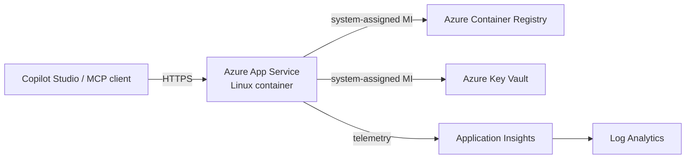

# Azure deployment

Deploy darbot-browser-mcp to Azure App Service with managed identity, OAuth via Entra, and OpenTelemetry observability.

## Architecture



## Prerequisites

- Azure CLI (`az`) logged in with Contributor on the target subscription.
- A resource group name, Azure region, short environment, and region code.
- Optional: PowerShell 7 for `scripts/deploy.ps1`.

## Deploy

Bicep what-if is the default safety gate; deployment requires confirmation.

```bash
export AZURE_RESOURCE_GROUP=rg-darbot-dev-eus
export AZURE_LOCATION=eastus
export AZURE_PREFIX=darbot
export AZURE_ENVIRONMENT=dev
export AZURE_REGION_CODE=eus
./azure/scripts/deploy.sh
./azure/scripts/deploy.sh --confirm --build-image
```

PowerShell:

```powershell
$env:AZURE_RESOURCE_GROUP = 'rg-darbot-dev-eus'
$env:AZURE_LOCATION = 'eastus'
$env:AZURE_PREFIX = 'darbot'
$env:AZURE_ENVIRONMENT = 'dev'
$env:AZURE_REGION_CODE = 'eus'
./azure/scripts/deploy.ps1
./azure/scripts/deploy.ps1 -Confirm -BuildImage
```

The template creates App Service, App Service Plan, ACR, Key Vault, Application Insights, Log Analytics, and managed-identity RBAC assignments. Names follow `${prefix}-${env}-${region}-${role}` except ACR, which removes hyphens to satisfy Azure naming rules.

## Configuration reference

Bicep parameters: `prefix`, `environment`, `location`, `regionCode`, `appServiceSku`, `containerRegistrySku`, `containerImage`, `runtime`, `entraTenantId`, `entraClientId`, `authClientSecretName`, `serverBaseUrl`, `healthCheckPath`, `allowedOrigins`, `network`, `extraTags`.

App settings: `PORT`, `WEBSITES_PORT`, `SERVER_BASE_URL`, `AZURE_TENANT_ID`, optional `AZURE_CLIENT_ID`, optional Key Vault-referenced `AZURE_CLIENT_SECRET`, `ENTRA_AUTH_ENABLED`, `COPILOT_STUDIO_ENABLED`, `AUDIT_LOGGING_ENABLED`, `MAX_CONCURRENT_SESSIONS`, `SESSION_TIMEOUT_MS`, `APPLICATIONINSIGHTS_CONNECTION_STRING`, `OTEL_SERVICE_NAME`, `OTEL_RESOURCE_ATTRIBUTES`, optional `ALLOWED_ORIGINS`.

No production parameter files or secret values belong in source control. If an OAuth client secret is required, set `authClientSecretName`, deploy, then run:

```bash
az keyvault secret set --vault-name <output-key-vault-name> --name <secret-name> --value '<secret-from-safe-store>'
```

## Operations

- Rolling deploy: build a new image tag with `az acr build`, update `containerImage.tag`, run what-if, then deploy.
- Scale: change `appServiceSku` or use `az appservice plan update --number-of-workers <n>`.
- Monitor: use Application Insights live metrics, failures, and Log Analytics queries.
- Rollback: redeploy the previous image tag and restart the web app.
- Teardown: `AZURE_RESOURCE_GROUP=<rg> ./azure/scripts/teardown.sh` previews; add `--confirm` to delete tagged resources.

## Cost notes

Default `B1` App Service and `Basic` ACR are low-cost development defaults. Production should use Premium v3 App Service, reserved capacity where appropriate, log-retention budgets, and autoscale limits.

## Security notes

The App Service is public by default. Restrict access with App Service access restrictions, private endpoints, WAF/Front Door, and `network.publicNetworkAccess=Disabled` only after private connectivity exists. ACR admin user is disabled. Key Vault uses RBAC, soft delete, purge protection, and managed identity. Secrets are referenced from Key Vault, not stored in parameter files.

## Disaster recovery

Keep Bicep parameters, Entra app registration metadata, and image tags in release records. To recover in a paired region, create a new resource group, choose a new `regionCode`, deploy from this template, import or recreate required Key Vault secrets from the approved secret store, push the last known-good image tag to the new ACR, update DNS/OAuth redirect URIs, and validate `/healthz`, `/openapi.json`, and MCP endpoints before routing users.
