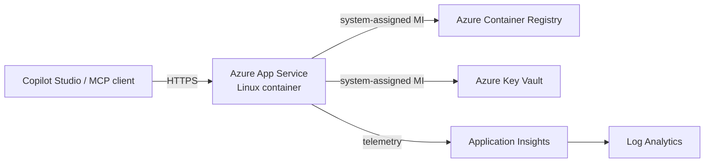

# Azure deployment

Deploy darbot-browser-mcp to Azure App Service with managed identity, OAuth via Entra, and OpenTelemetry observability.

> [!IMPORTANT]
> The Bicep template provisions a new convention-named stack. It does not
> discover or upgrade an existing App Service, plan, registry, Key Vault, or
> monitoring resource. Always run `what-if` and inspect resource names before
> applying it to a resource group that already contains Darbot resources.

## Architecture



## Prerequisites

- Azure CLI (`az`) logged in with Contributor on the target subscription.
- A resource group name, Azure region, short environment, and region code.
- Optional: PowerShell 7 for `scripts/deploy.ps1`.

## Deploy

Bicep what-if is the default safety gate; deployment requires confirmation.

```bash
export AZURE_RESOURCE_GROUP=rg-darbot-dev-eus
export AZURE_LOCATION=eastus
export AZURE_PREFIX=darbot
export AZURE_ENVIRONMENT=dev
export AZURE_REGION_CODE=eus
./azure/scripts/deploy.sh
./azure/scripts/deploy.sh --confirm --build-image
```

PowerShell:

```powershell
$env:AZURE_RESOURCE_GROUP = 'rg-darbot-dev-eus'
$env:AZURE_LOCATION = 'eastus'
$env:AZURE_PREFIX = 'darbot'
$env:AZURE_ENVIRONMENT = 'dev'
$env:AZURE_REGION_CODE = 'eus'
./azure/scripts/deploy.ps1
./azure/scripts/deploy.ps1 -Confirm -BuildImage
```

The template creates App Service, App Service Plan, ACR, Key Vault, Application Insights, Log Analytics, and managed-identity RBAC assignments. Names follow `${prefix}-${env}-${region}-${role}` except ACR, which removes hyphens to satisfy Azure naming rules.

## Upgrade an existing App Service without provisioning resources

For an existing deployment, build a new immutable tag in its current ACR and
change only the existing App Service `linuxFxVersion`. Do not run `azd up`,
`azd provision`, or this Bicep template when the goal is an in-place image
upgrade.

```powershell
$resourceGroup = '<existing-resource-group>'
$appName = '<existing-app-service>'
$registryName = '<existing-acr>'
$registryHost = '<existing-acr>.azurecr.io'
$tag = '2.1.4-<release-commit>'

az acr build `
  --registry $registryName `
  --image "darbot-browser-mcp:$tag" `
  --file 'azure\docker\Dockerfile.appservice' `
  --platform linux/amd64 `
  .

$previousImage = az webapp config show `
  --resource-group $resourceGroup `
  --name $appName `
  --query linuxFxVersion `
  --output tsv

az webapp config set `
  --resource-group $resourceGroup `
  --name $appName `
  --linux-fx-version "DOCKER|$registryHost/darbot-browser-mcp:$tag"

az webapp restart --resource-group $resourceGroup --name $appName
```

Rollback by restoring `$previousImage` with `az webapp config set` and
restarting the app. Preserve the existing app settings during an image-only
upgrade; authentication and registry-credential changes should be separate,
independently validated operations.

## Configuration reference

Bicep parameters: `prefix`, `environment`, `location`, `regionCode`, `appServiceSku`, `containerRegistrySku`, `containerImage`, `runtime`, `entraTenantId`, `entraClientId`, `authClientSecretName`, `serverBaseUrl`, `healthCheckPath`, `allowedOrigins`, `network`, `extraTags`.

App settings: `PORT`, `WEBSITES_PORT`, `SERVER_BASE_URL`, `AZURE_TENANT_ID`, optional `AZURE_CLIENT_ID`, optional Key Vault-referenced `AZURE_CLIENT_SECRET`, `ENTRA_AUTH_ENABLED`, `COPILOT_STUDIO_ENABLED`, `AUDIT_LOGGING_ENABLED`, `MAX_CONCURRENT_SESSIONS`, `SESSION_TIMEOUT_MS`, `APPLICATIONINSIGHTS_CONNECTION_STRING`, `OTEL_SERVICE_NAME`, `OTEL_RESOURCE_ATTRIBUTES`, optional `ALLOWED_ORIGINS`.

No production parameter files or secret values belong in source control. If an OAuth client secret is required, set `authClientSecretName`, deploy, then run:

```bash
az keyvault secret set --vault-name <output-key-vault-name> --name <secret-name> --value '<secret-from-safe-store>'
```

## Operations

- New stack: build a new image tag, update `containerImage.tag`, run what-if, then deploy.
- Existing stack: use the image-only procedure above so no additional Azure resources are created.
- Scale: change `appServiceSku` or use `az appservice plan update --number-of-workers <n>`.
- Monitor: use Application Insights live metrics, failures, and Log Analytics queries.
- Rollback: redeploy the previous image tag and restart the web app.
- Teardown: `AZURE_RESOURCE_GROUP=<rg> ./azure/scripts/teardown.sh` previews; add `--confirm` to delete tagged resources.

## Browser state and storage

The container starts without `--isolated`, so Playwright uses a persistent
browser context inside that container instance. The template also sets
`WEBSITES_ENABLE_APP_SERVICE_STORAGE=false`; browser history, cookies, cache,
and filesystem session snapshots therefore do not survive container
replacement unless an operator explicitly configures a supported persistent
mount.

The runtime does not currently upload browser profiles, session snapshots, or
audit records to Azure Blob Storage. Provisioning a storage account or granting
`Storage Blob Data Contributor` does not by itself enable persistence.

## Authentication readiness

`ALLOW_ANONYMOUS_ACCESS=true` short-circuits all configured authentication
methods. Disable it only after a client can acquire a token whose audience is
the Darbot API application. The Entra app registration must expose an API scope,
and clients must request that custom scope; the Microsoft Graph `User.Read`
scope produces a Graph-audience token and is not sufficient for Darbot bearer
validation.

## Cost notes

Default `B1` App Service and `Basic` ACR are low-cost development defaults. Production should use Premium v3 App Service, reserved capacity where appropriate, log-retention budgets, and autoscale limits.

## Security notes

The App Service is public by default. Restrict access with App Service access restrictions, private endpoints, WAF/Front Door, and `network.publicNetworkAccess=Disabled` only after private connectivity exists. ACR admin user is disabled. Key Vault uses RBAC, soft delete, purge protection, and managed identity. Secrets are referenced from Key Vault, not stored in parameter files.

## Disaster recovery

Keep Bicep parameters, Entra app registration metadata, and image tags in release records. To recover in a paired region, create a new resource group, choose a new `regionCode`, deploy from this template, import or recreate required Key Vault secrets from the approved secret store, push the last known-good image tag to the new ACR, update DNS/OAuth redirect URIs, and validate `/health`, `/openapi.json`, and MCP endpoints before routing users.
