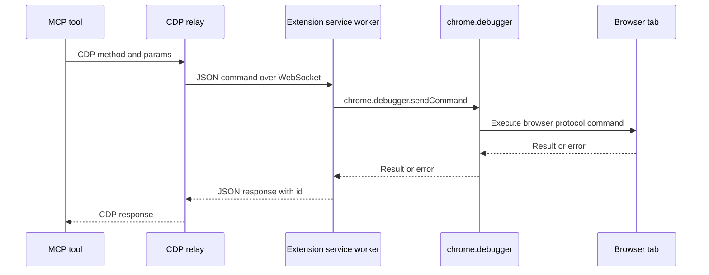

# Bridge protocol

This reference documents the browser extension bridge protocol used by the CDP relay and Chrome/Edge extension.

You'll learn:

- Which WebSocket channels are opened in extension mode.
- How CDP commands flow between MCP and the browser extension.
- What status data is available from `/bridge`.

## Channels

| Channel | Purpose |
| --- | --- |
| `/extension` | Browser extension connects to the relay and advertises tab/session metadata. |
| `/cdp` | MCP browser context connects as a Chromium CDP client. |
| `/bridge` | HTTP status endpoint for auto-detection and diagnostics. |
| `/mcp` | MCP Streamable HTTP endpoint used by clients. |

## Message flow

## Status contract

`GET /bridge` reports:

- `bridge`: bridge implementation name.
- `version`: server bridge version.
- `extensionConnected`: whether the extension WebSocket is connected.
- `mcpConnected`: whether an MCP/CDP client is connected.
- `targetInfo`: current tab URL, title, and type when known.
- `sessionId`: bridge session identifier when available.
- `extensionVersion`: extension version when provided.

## Compatibility notes

- The extension requires Chrome/Edge debugger permission.
- The bridge targets Chromium CDP; Firefox and WebKit are not supported in bridge mode.
- Device emulation is not supported in bridge mode.
- Multi-tab commands depend on the extension and relay target model; launched-browser mode remains the most complete multi-tab runtime.
---

_Last updated: 2026-05-18 (v2.0.0)_
