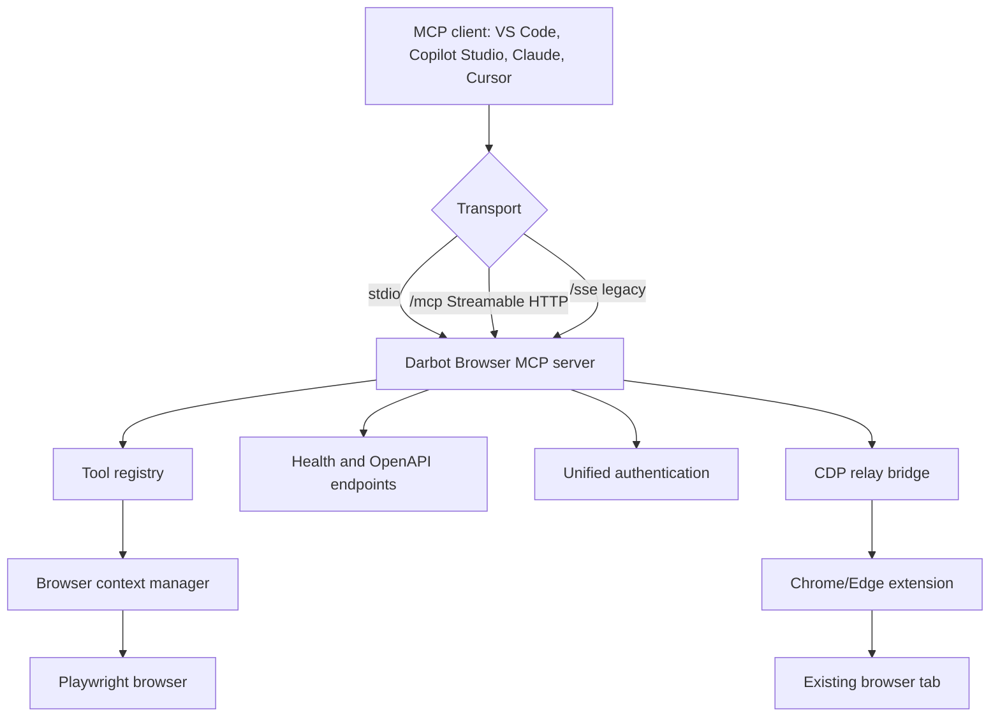

# Architecture overview

This overview describes the core v2.0.0 components and how MCP clients, transports, tools, browsers, and integrations connect.

You'll learn:

- Which processes exist in local, HTTP, and bridge mode.
- How tool calls become browser actions.
- Where cloud integrations and authentication fit.

## Component model

## Request flow

1. The client sends an MCP tool request over stdio, Streamable HTTP, or SSE.
2. The server validates transport session state and authentication when enabled.
3. The registered tool validates parameters with Zod.
4. The tool produces Playwright operations and optional response content.
5. The browser context executes the action in a launched browser or through the bridge CDP endpoint.
6. The server returns text, image, file, or structured MCP content.

## Tool modes

Default mode uses accessibility snapshots and deterministic selectors. Vision mode replaces snapshot-oriented tools with screen-coordinate tools for clients that need screenshot reasoning.

## Cloud services

HTTP deployments add `/health`, `/ready`, `/live`, `/openapi.json`, Entra/OAuth/API key authentication, and cloud-friendly `PORT` support. See [Azure deployment](../integrations/azure-deployment.md).

## Extension bridge

The bridge allows Darbot to automate an existing authenticated Chrome or Edge tab through `chrome.debugger`. See [Bridge protocol](bridge-protocol.md) and [Bridge auto-detection](../guides/bridge-auto-detection.md).
---

_Last updated: 2026-05-18 (v2.0.0)_
