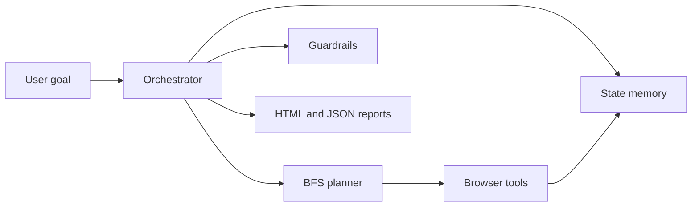

# Autonomous features

This guide explains the autonomous crawl stack: memory, planning, guardrails, reporting, and orchestration.

You'll learn:

- How `browser_start_autonomous_crawl` plans and executes site exploration.
- What safety controls run before autonomous actions.
- Where crawl memory and reports are stored.

## Components



## Memory

The memory layer stores visited URL metadata, accessibility snapshots, screenshots, and state hashes. Hashing prevents repeated work when multiple routes reach the same DOM state. Local file storage is the default; the design leaves room for a `darbot-memory-mcp` connector.

## Planning

The planner uses breadth-first search with configurable depth, page limits, and domain filters. It scores candidate links and click targets so the crawler prioritizes meaningful navigation over repeated chrome, login links, or destructive controls.

## Guardrails

Autonomous actions pass through rate limits, domain checks, URL pattern blocks, loop detection, and destructive-action filters. Default protections avoid login, registration, admin, email, social media, and downloadable-file patterns unless explicitly allowed.

## Tools

```javascript
await browser_start_autonomous_crawl({
  startUrl: "https://example.com",
  goal: "Map product documentation",
  maxDepth: 3,
  maxPages: 25,
  allowedDomains: ["example.com"],
  generateReport: true,
  takeScreenshots: true,
  memoryEnabled: true
});

await browser_configure_memory({
  enabled: true,
  connector: "local",
  storagePath: ".darbot/crawl-memory",
  maxStates: 500
});
```

## Reports

Reports are written under the configured output directory with an HTML overview, raw JSON, screenshots, visited states, errors, and timing data. Treat reports as artifacts; do not commit them unless a test fixture explicitly requires it.

The `browser_memory_list` and `browser_memory_clear` management tools only
accept storage locations beneath `DARBOT_MEMORY_DIR` (default:
`<cwd>/.darbot/memory`). Clear operations remove validated crawl-state files
only and leave unrelated files untouched.

## Operational guidance

- Keep `maxDepth` and `maxPages` conservative for unknown sites.
- Use `allowedDomains` for production crawls.
- Review generated reports before using crawl output as source-of-record data.
- Prefer [session states](session-states.md) for authenticated checkpoints instead of re-running login flows.
---

_Last updated: 2026-08-10 (v2.1.4)_
