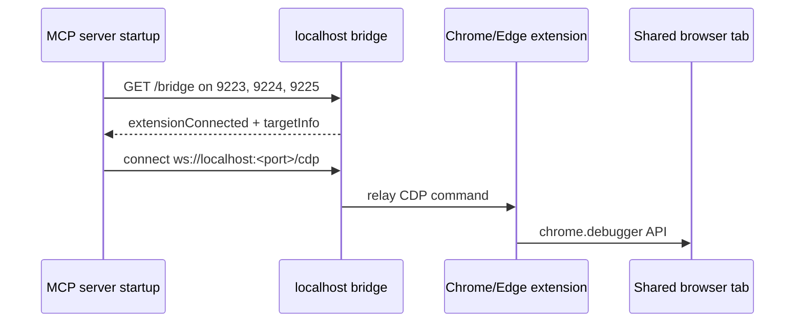

# Bridge auto-detection

This guide explains how Darbot Browser MCP v2.1.4 discovers an existing Chrome or Edge extension bridge without manual `--cdp-endpoint` wiring.

You'll learn:

- Which ports are scanned and why.
- What `/bridge` returns.
- How the browser extension, CDP relay, and MCP server coordinate.

## Bridge auto-detection behavior

When no `--cdp-endpoint` is supplied and `--extension` is not explicitly requested, the server scans well-known bridge ports `9223`, `9224`, and `9225`. If a bridge reports an attached extension and target tab, Darbot sets the Chromium CDP endpoint automatically.



## Manual bridge mode

Start a relay for the extension:

```bash
npx @darbotlabs/darbot-browser-mcp@2.1.4 --port 9223 --extension --browser msedge
```

The server exposes:

- `http://localhost:9223/mcp` for Streamable HTTP MCP.
- `http://localhost:9223/bridge` for bridge status.
- `ws://localhost:9223/cdp` for CDP clients.
- `ws://localhost:9223/extension` for the browser extension.

## Status payload

`/bridge` returns connection state similar to:

```json
{
  "bridge": "cdp-relay",
  "version": "2.1.4",
  "extensionConnected": true,
  "mcpConnected": true,
  "targetInfo": {
    "url": "https://example.com",
    "title": "Example Domain",
    "type": "page"
  },
  "sessionId": "...",
  "extensionVersion": "2.1.4"
}
```

## When to use it

Use the bridge when the agent must operate in a browser tab that already has user context, enterprise SSO, or a manually prepared state. Use a normal Playwright-launched browser for isolated tests, reproducible CI, or workflows that must not touch a user's active browser.

## Troubleshooting

- If detection fails, confirm the bridge server is listening on `9223`, `9224`, or `9225`.
- Open the extension popup and verify it is connected to the relay.
- Check `/bridge` before debugging MCP client settings.
- Single-tab bridge sessions may not support every tab-management pattern; fall back to launched-browser mode for multi-tab test generation.
---

_Last updated: 2026-08-10 (v2.1.4)_
