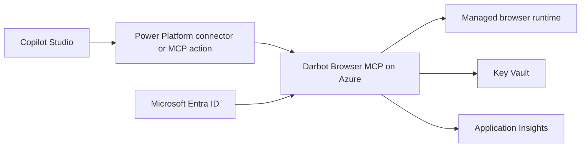

# Copilot Studio integration

This guide describes how to expose Darbot Browser MCP as an enterprise browser automation backend for Microsoft Copilot Studio.

You'll learn:

- How to deploy an HTTP MCP endpoint for Copilot Studio.
- Which authentication settings are required.
- How OpenAPI and Power Platform connector paths relate.

## Recommended architecture



## Deploy the server

```bash
git clone https://github.com/darbotlabs/darbot-browser-mcp.git
cd darbot-browser-mcp
./azure/deploy.sh my-resource-group darbot-mcp-prod eastus
```

The deployment should provide:

- MCP endpoint: `https://<app>.azurewebsites.net/mcp`
- Health endpoint: `https://<app>.azurewebsites.net/health`
- Readiness endpoint: `https://<app>.azurewebsites.net/ready`
- OpenAPI endpoint: `https://<app>.azurewebsites.net/openapi.json`

## Authentication

Set the following for Entra-backed OAuth and bearer-token validation:

```bash
SERVER_BASE_URL=https://<app>.azurewebsites.net
ENTRA_AUTH_ENABLED=true
AZURE_TENANT_ID=<tenant-id>
AZURE_CLIENT_ID=<client-id>
AZURE_CLIENT_SECRET=<client-secret>
COPILOT_STUDIO_ENABLED=true
```

`SERVER_BASE_URL` is required so OAuth metadata and redirect URLs match the deployed origin.

## Copilot Studio connection options

### Direct MCP endpoint

Use the Streamable HTTP endpoint when Copilot Studio can consume remote MCP tools directly:

```json
{
  "mcpServers": {
    "darbot-browser": {
      "url": "https://<app>.azurewebsites.net/mcp",
      "auth": { "type": "bearer", "token": "<access-token>" }
    }
  }
}
```

### OpenAPI or connector path

Use `/openapi.json` for connector generation and tool discovery. The OpenAPI document describes health operations and each MCP tool invocation shape. See [Power Platform](power-platform.md) for connector guidance.

## Operational checklist

- Require HTTPS at the ingress.
- Enable Entra ID or API key auth before exposing `/mcp`.
- Monitor `/health`, `/ready`, and application logs.
- Set conservative session concurrency and timeout limits.
- Keep browser automation targets allowlisted where possible.
---

_Last updated: 2026-08-10 (v2.1.4)_
