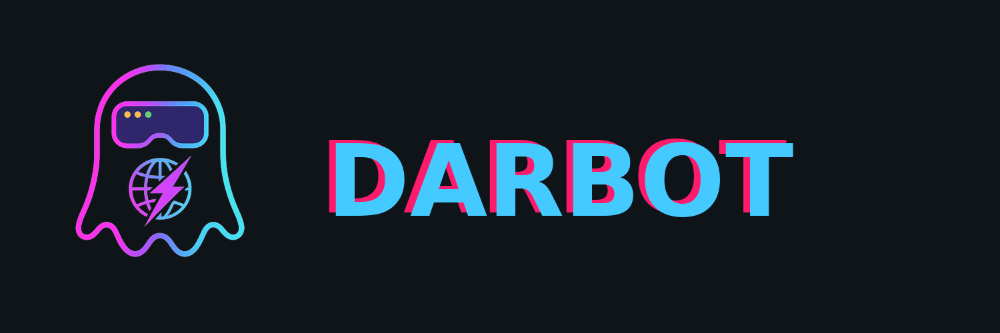

# 🤖 Darbot Browser MCP - VS Code Extension



**Your Autonomous Browser Companion for VS Code**

Transform your coding workflow with intelligent autonomous browser capabilities directly integrated into VS Code. This extension provides seamless access to 29 autonomous browser tools through GitHub Copilot Chat, enabling you to automate web interactions, test applications, and manage browser sessions without leaving your IDE.

[](https://marketplace.visualstudio.com/items?itemName=darbotlabs.darbot-browser-mcp)
[](https://marketplace.visualstudio.com/items?itemName=darbotlabs.darbot-browser-mcp)
[](https://marketplace.visualstudio.com/items?itemName=darbotlabs.darbot-browser-mcp)

---

## ✨ Features

- **🌐 Multi-Browser Support** - Edge, Chrome, Firefox, WebKit autonomous control
- **📸 Smart Snapshots** - AI-optimized autonomous accessibility snapshots  
- **🖱️ Autonomous Interactions** - Autonomous click, type, navigate, form filling, drag & drop
- **📁 Autonomous Work Profiles** - Autonomously save and restore complete browser sessions
- **🔧 Native VS Code Integration** - Seamless autonomous MCP server with GitHub Copilot Chat
- **⚡ Real-time Autonomous Control** - Live autonomous browser operations from your IDE
- **🎮 Status Management** - Start/Stop server with visual status indicators
- **🧪 Autonomous Test Generation** - Autonomously generate automated tests from browser interactions
- **📱 Mobile Emulation** - Autonomous testing of responsive designs with device emulation
- **🛡️ Professional Grade** - Enterprise-ready autonomous browser with comprehensive error handling

## 🛠️ Installation

### **Automatic Setup (Recommended)**
1. **Install the extension** from the VS Code marketplace
2. **Auto-configuration**: The extension automatically:
   - Prompts to enable MCP in VS Code settings (`"chat.mcp.enabled": true`)
   - Configures the Darbot Browser MCP server in your MCP settings
   - Sets up the server path: `npx github:pantelisbischitzis/darbot-browser-mcp`
3. **Start the server**: Use Command Palette → "Darbot Browser MCP: Start Server"
4. **Test with GitHub Copilot**: Ask Copilot to "take a screenshot of example.com"

### **Manual Setup (Advanced)**
If you prefer manual configuration:
1. Enable MCP in VS Code settings: `"chat.mcp.enabled": true`  
2. Configure the server path in extension settings (defaults to NPM CLI detection)
3. Use the command palette or status bar to start/stop the server

### **What Happens After Installation**
When you first activate the extension:
- 🔧 **Auto-detects MCP availability** and prompts to enable if needed
- ⚙️ **Auto-configures the MCP server** in your VS Code settings (`chat.mcp.servers`)
- 📊 **Adds status bar indicator** showing server state (Running/Stopped)
- 🚀 **Ready to use** with GitHub Copilot Chat immediately
- 💡 **Shows helpful prompts** to restart VS Code or start the server

## 🎮 Usage Examples

**With GitHub Copilot Chat:**
```
👤 "Take a screenshot of example.com"
🤖 I'll autonomously navigate to example.com and capture a screenshot for you.

👤 "Navigate to example.com and click the More information link"  
🤖 I'll autonomously navigate to example.com and locate the "More information..." link to click.

👤 "Save this browser session as 'research-profile'"
🤖 I'll autonomously save the current browser state as a work profile named 'research-profile'.

👤 "Fill out the contact form with test data"
🤖 I'll autonomously fill the contact form with appropriate test data.

👤 "Generate an automated test for the login flow"
🤖 I'll autonomously create an automated test based on the current page interactions.
```

**Direct Commands:**
- `Ctrl+Shift+P` → "Darbot Browser MCP: Start Server"
- Use status bar indicator to monitor server health
- Configure browser preferences in VS Code settings

## Configuration

### Basic Settings

- `darbot-browser-mcp.serverPath`: Path or command to start the Browser MCP server (default: `npx github:pantelisbischitzis/darbot-browser-mcp`)
- `darbot-browser-mcp.autoStart`: Automatically start the server when VS Code starts (default: `false`)
- `darbot-browser-mcp.autoConfigureMCP`: Automatically configure MCP settings when first activated (default: `true`)
- `darbot-browser-mcp.logLevel`: Log level for the server (error, warn, info, debug) (default: `info`)

### Browser Selection & Versions

Choose your preferred browser and version channel:

- `darbot-browser-mcp.browser`: Select browser channel (default: `msedge`)
  - **Microsoft Edge**: `msedge` (Stable), `msedge-beta`, `msedge-dev`, `msedge-canary`
  - **Google Chrome**: `chrome` (Stable), `chrome-beta`, `chrome-dev`, `chrome-canary`
  - **Mozilla Firefox**: `firefox` (Stable), `firefox-developer`, `firefox-nightly`
  - **WebKit**: `webkit` (Safari Technology Preview)

- `darbot-browser-mcp.browserExecutablePath`: Custom path to browser executable (default: empty for auto-detection)
  - Use this if auto-detection fails or you want a specific installation
  - Example (Windows): `C:\Program Files\Microsoft\Edge Dev\Application\msedge.exe`
  - Example (macOS): `/Applications/Google Chrome Canary.app/Contents/MacOS/Google Chrome Canary`
  - Example (Linux): `/usr/bin/firefox-developer-edition`

**Browser Configuration Examples:**

```json
// Use Edge Dev channel (auto-detected)
{
  "darbot-browser-mcp.browser": "msedge-dev"
}

// Use Chrome Canary with custom path
{
  "darbot-browser-mcp.browser": "chrome-canary",
  "darbot-browser-mcp.browserExecutablePath": "C:\\Users\\YourName\\AppData\\Local\\Google\\Chrome SxS\\Application\\chrome.exe"
}

// Use Firefox Developer Edition (auto-detected)
{
  "darbot-browser-mcp.browser": "firefox-developer"
}
```

### Advanced Configuration

You can also configure the server with additional arguments by modifying the `serverPath` setting:

```json
{
  "darbot-browser-mcp.serverPath": "npx github:pantelisbischitzis/darbot-browser-mcp --headless --device 'iPhone 15'"
}
```

Common configuration options:
- `--headless`: Run browser in headless mode
- `--device "iPhone 15"`: Emulate mobile devices
- `--isolated`: Use isolated browser sessions
- `--vision`: Enable vision mode for screenshot-based interactions

## Commands

- `Darbot Browser MCP: Start Server`: Start the Browser MCP server
- `Darbot Browser MCP: Stop Server`: Stop the Browser MCP server  
- `Darbot Browser MCP: Show Status`: Show server status and controls

## 🔧 Requirements

- **Node.js**: Version 18.0.0 or higher
- **VS Code**: Version 1.96.0 or higher
- **Browser**: Microsoft Edge (recommended) or Chrome/Firefox/WebKit
- **MCP Support**: Enable `"chat.mcp.enabled": true` in VS Code settings

## 🐛 Troubleshooting

**Extension not loading?**
- Check VS Code Developer Console (`Ctrl+Shift+I`)
- Verify Node.js 18+ is installed
- Ensure MCP is enabled in settings

**Browser automation failing?**
- Confirm Microsoft Edge is installed
- Check firewall/antivirus blocking browser automation
- Try disabling sandbox mode in extension settings

**MCP server not discovered?**
- Restart VS Code after installation
- Use Command Palette: "MCP: Show Installed Servers"
- Check extension status in "Extensions" panel
- If you prefer manual setup, disable auto-configuration: `"darbot-browser-mcp.autoConfigureMCP": false`

## 📄 License

Apache License 2.0 - see [LICENSE](https://github.com/darbotlabs/darbot-browser-mcp/blob/main/LICENSE) for details.

## 🔗 Links

- **[GitHub Repository](https://github.com/darbotlabs/darbot-browser-mcp)** - Source code and documentation
- **[Issues & Support](https://github.com/darbotlabs/darbot-browser-mcp/issues)** - Bug reports and feature requests
- **[Darbot Labs](https://github.com/darbotlabs)** - More AI automation tools

---

**⭐ If this extension helps your workflow, please rate it on the marketplace!**

**Made with ❤️ by Darbot Labs**